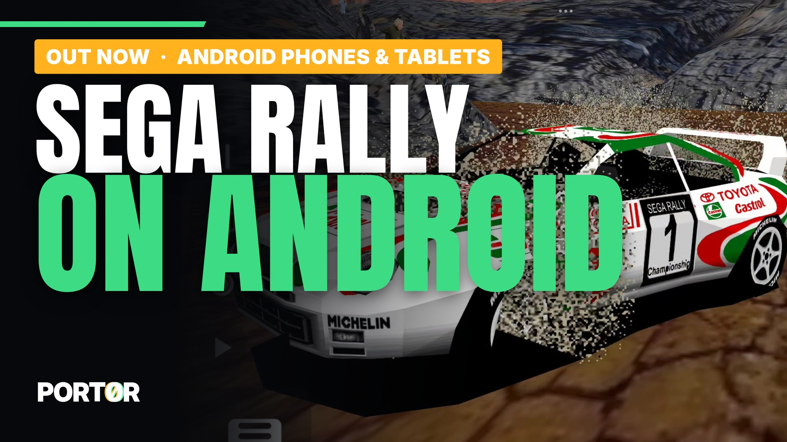
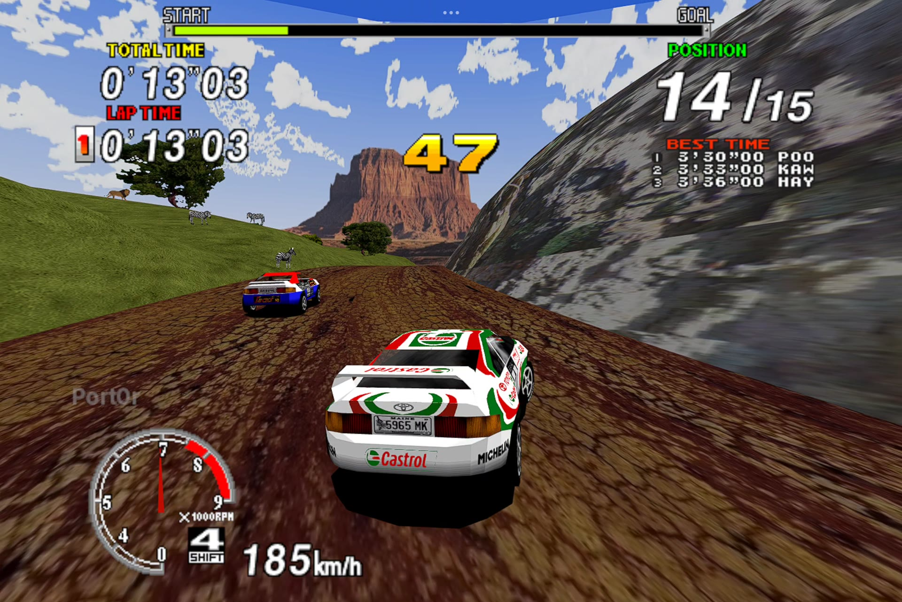
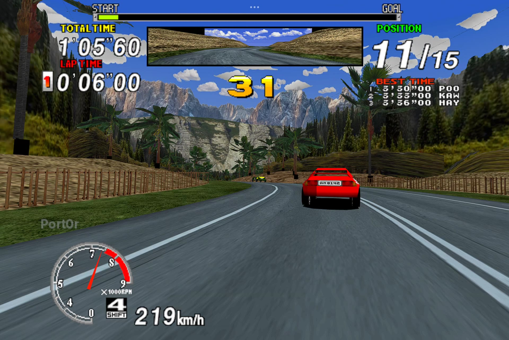
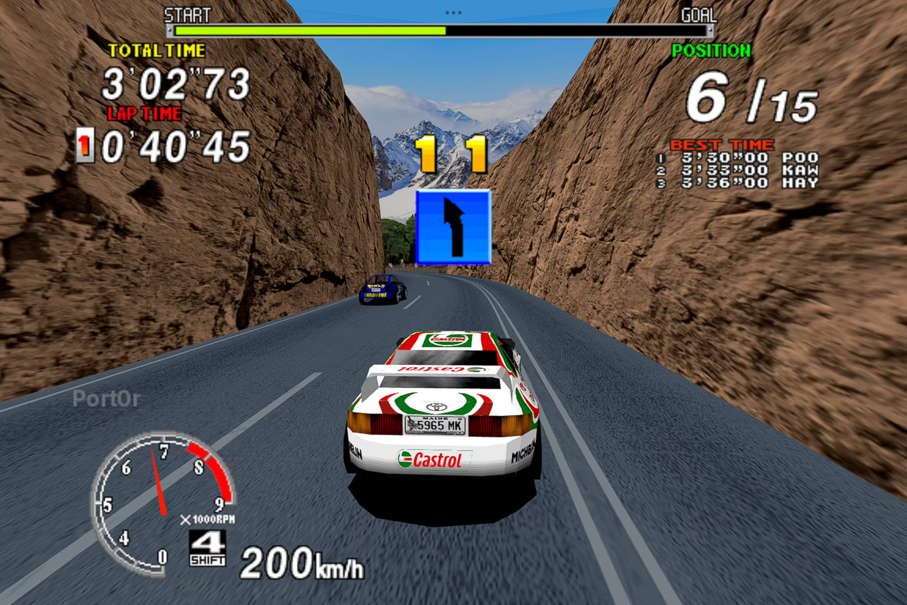
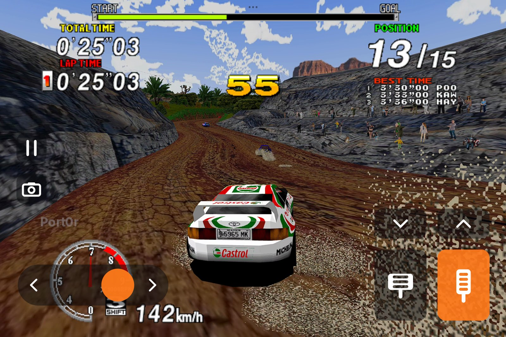
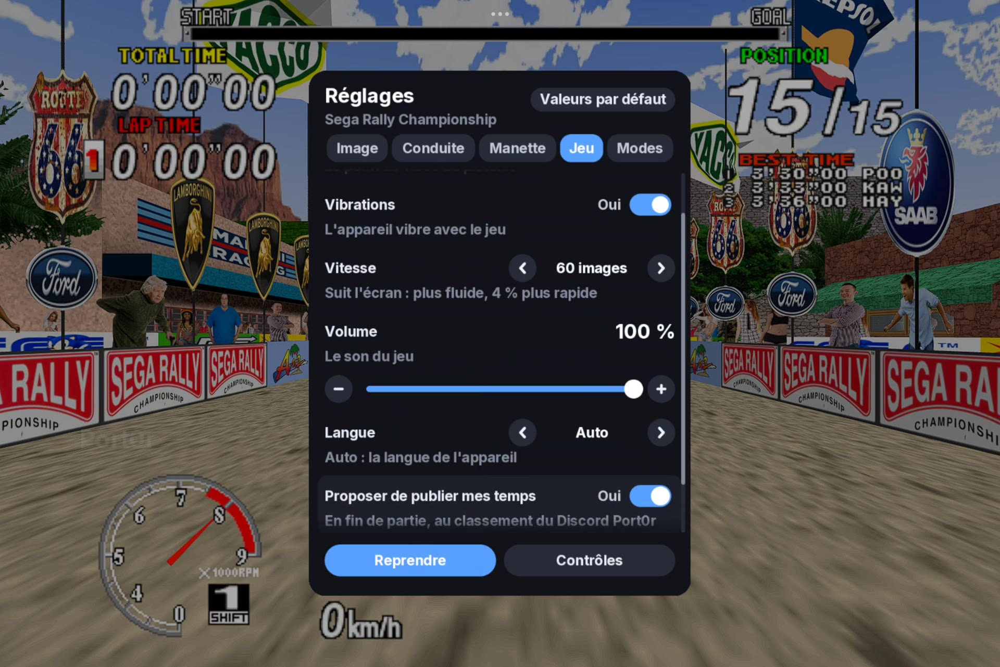
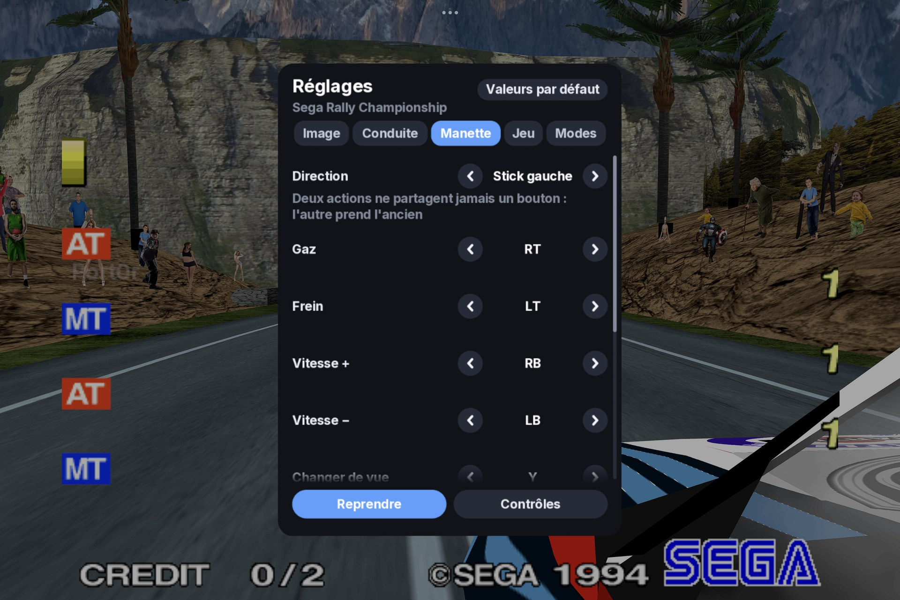

  

  <a href="https://discord.gg/XMk7GgapuN"><b>Discord</b></a> ·
  <a href="https://github.com/jacquesdupontd/port0r/releases/tag/android-v0.1.0"><b>Download</b></a> ·
  <a href="https://ko-fi.com/port0r"><b>Ko-fi</b></a> ·
  <a href="README.md"><b>Port0r on Meta Quest (VR)</b></a> ·
  <a href="SWITCH.md"><b>Nintendo Switch</b></a>

# Sega Rally on Android

**The 1995 arcade Sega Rally Championship on your phone or tablet, free, from the people who made Port0r: Rally VR.**

> ### Download Sega Rally for Android v0.1.0 (free)
> **[Port0r-SegaRally-Android-v0.1.0.apk](https://github.com/jacquesdupontd/port0r/releases/download/android-v0.1.0/Port0r-SegaRally-Android-v0.1.0.apk)**
> from the [release page](https://github.com/jacquesdupontd/port0r/releases/tag/android-v0.1.0). Then follow the
> [install guide](#install): a few minutes. **You bring your own game files.**

The whole track in **true full screen**: the arcade's picture at its full height, HUD included, and the world widened to
fill a modern screen. Drawn by the same Vulkan renderer as Port0r: Rally VR, at **60 images a second**, with a
**dynamic resolution** that keeps it smooth and a **sharpening** pass that keeps it crisp. Jean-seb's community **HD
textures** if you want them. **Touch controls designed for racing**, steering by **turning or tilting the device**, any
**gamepad**, the Sega Rally **mods**, and your times on the **Port0r Discord leaderboard**.

| Desert | Forest | Mountain |
| --- | --- | --- |
|  |  |  |
| **Touch controls** | **Settings** | **Gamepad** |
|  |  |  |

*All screenshots: captured from a Xiaomi Pad 7 (Snapdragon 7+ Gen 3), HD textures on.*

---

## Contents

- [What you need](#what-you-need)
- [Install](#install)
- [Controls](#controls)
- [Settings](#settings)
- [HD textures](#hd-textures)
- [The leaderboard on Discord](#the-leaderboard-on-discord)
- [Troubleshooting](#troubleshooting)
- [Known limits](#known-limits)
- [Help, bugs, support](#help-bugs-support)
- [Credits and legal](#credits-and-legal)

## What you need

- An Android phone or tablet with **Android 8 or newer** and **Vulkan** (most devices from 2019 on). Tested on a
  Snapdragon 7+ Gen 3 tablet: 60 images a second at its full 3200x2136. On a lighter device the dynamic resolution
  lowers the picture's sharpness before the smoothness.
- **Your own** Sega Rally Championship arcade files, made for **MAME 0.289**: `srallyc.zip` and `segabill.zip`.
  Port0r never includes them and never says where to get them. No ROM requests on the Discord, please.
- Optional: a gamepad (Bluetooth or USB), and Jean-seb's HD texture pack.

## Install

1. **Download** `Port0r-SegaRally-Android-v0.1.0.apk` on the device and open it. Android asks to allow installing
   apps from your browser or file manager: allow it for that app, then install.
2. **Put your game files anywhere on the device**: `srallyc.zip` and `segabill.zip`, **not unzipped**. The Download
   folder is the simplest.
3. **Open Port0r: Rally.** The first time, it asks for **access to all files**, to find your game files wherever they
   are: allow it and come back. The game starts by itself.

If a file is missing or not the right version, the start screen names it and says what to do; it starts as soon as the
right files are there. Port0r: Rally installs **next to** Port0r: Rally VR (Quest): they do not replace each other.

## Controls

### On the screen

| Action | Touch |
|---|---|
| Steer | Put your left thumb anywhere on the left half and slide: the slider appears under it |
| Gas / brake | Bottom right: the brake, then the gas in the corner, side by side; slide from one to the other |
| Gears (manual cars) | The arrows above the pedals |
| Pause, the settings | The pause button, on the left |
| Change view | The camera button, on the left |
| Insert a coin / Start | The coin and play buttons, on the left (outside a race) |

Every control can be made bigger, smaller or more transparent (Settings > Driving). **Progressive gas** (Settings >
Driving) turns the gas pedal into a gauge: slide up for more, from 30 % at its foot to full throttle at its top; off,
it is always full throttle.

### Steering with the device

Settings > Driving > Steering:
- **Turn the device**: hold it like a wheel and turn it.
- **Tilt the device**: tip the right edge down to turn right.

The left half of the screen is then the brake, the right half the gas. **Steering angle**, **smoothing**, **dead
zone**, **invert** and **Straight ahead = as I hold it now** (to recentre) are in the same tab. When a gamepad is in
use, the device's angle is ignored: the last thing you touched drives.

### With a gamepad

| Action | Button (default) |
|---|---|
| Steer | Left stick (or the right stick, or the d-pad: Settings > Gamepad > Steering) |
| Gas / brake | RT / LT (analog) |
| Gears (manual cars) | RB up, LB down |
| Change view | Y |
| Start | A |
| Insert a coin | Select (a short press) |
| **Pause, the settings** | **Start** |
| Show / hide the touch controls | **Select held** (or L3) |
| In the settings | D-pad or stick to move, left / right to change, LB / RB tabs, A to choose, B to close |

Every action can be moved to another button in **Settings > Gamepad**; two actions never share a button (the other
one takes the old button). The touch controls disappear as soon as the gamepad is used, and come back when you touch
the screen.

## Settings

Start (or the pause button) pauses the game and opens the settings.

- **Image**: **Resolution** (Auto: lowered only when the device cannot keep up; or Full, Balanced, Light), **Sharpness**,
  **Frame rate** (60, the game's own rate, cooler and longer on battery; or the screen's maximum), **HD textures**,
  **Brightness**, **Style** (colour, black and white, comic, night).
- **Driving**: how you steer, the device's steering settings, the touch controls (on or off, opacity, size),
  progressive gas.
- **Gamepad**: every button.
- **Game**: vibrations (the knocks and the landings), speed (the arcade's own, or 60 images a second), volume,
  language (ten languages), the Discord leaderboard.
- **Mods** (the Switch build's, same rules): free timer, free play, sporty automatic, adaptive steering, mirrored track,
  telemetry.
- **Controls**: everything above, on one page.

## HD textures

Jean-seb's community pack, optional. Put its zip anywhere on the device (the Download folder is the simplest): it is set
up by itself at the next launch. Settings > Image > HD textures switches it on or off.

## The leaderboard on Discord

At the end of a game, Port0r offers to publish your times (Settings > Game). The first time, it shows a code: link your
Discord once, and your times land in #leaderboard on the [Port0r Discord](https://discord.gg/XMk7GgapuN).

## Updates

The game checks for a new Android version once at launch, in the background (never during a race; a failed connection
never stops you playing). When there is one, a short message says so on the start screen, and the settings panel shows
**Version X available** at the top: open it to
read **what's new before installing anything**, then **Download and install**. The download is checked against the
release's SHA-256, then Android asks you to confirm the update; when it is done, choose **Open** to start the new version.
Your settings, records and game files are kept.

- Settings > Game > **Check for updates automatically** switches the launch check off; **Updates > Check now** checks
  whenever you want.
- The first time, Android asks you to allow the game to install apps (once).
- **Google Play Protect** asks again at every update installed from the game, because each new version is a file it has
  never seen (the package name does not change that): choose to install it, after its scan or without.
- Nothing is sent but the request to GitHub's public release list.

## Troubleshooting

| What you see | What to do |
| --- | --- |
| The start screen lists missing files | Put `srallyc.zip` and `segabill.zip`, not unzipped, anywhere on the device (Download is the simplest), and allow file access if Android asks. They must be made for MAME 0.289. |
| It says a file is not the right version | Check your files against MAME 0.289 with a ROM manager; put the corrected ones anywhere on the device: they replace the old ones by themselves. |
| Google Play Protect asks to scan the app | It does so for every app installed outside the Play Store, and again for updates installed from the game: choose to install it (without scanning, or after the scan). |
| Installing is refused | Allow installing unknown apps for the app you downloaded with (your browser or file manager). On Xiaomi, also allow "Install via USB" only if you install from a computer. |
| The car turns on its own | Steering is set to Turn or Tilt the device and the device is not held straight: Settings > Driving > Steering > Touch, or Straight ahead = as I hold it now. |
| Not smooth on my device | Settings > Image > Resolution: Auto or Balanced, and Frame rate: 60. |
| No sound after plugging headphones or a gamepad | It comes back by itself within a second; if not, tell us in #bugs with your device. |
| Stuck anywhere | Ask on the [Discord](https://discord.gg/XMk7GgapuN): #install-help, or the bot in #ask-port0r. |

## Known limits

- First Android version: tested on one tablet (Xiaomi Pad 7, Android 15) with a Bluetooth gamepad. Phones, Android TV
  boxes and other gamepads: tell us how it goes.
- Some Android skins raise the screen's refresh rate while you touch it; the game stays at its own pace.
- Racing wheels (Logitech G29 and others) are read, but not yet tuned on Android.

## Help, bugs, support

- **Discord**: https://discord.gg/XMk7GgapuN (#install-help, #bugs, #wishes, #leaderboard)
- **Bugs**: #bugs, or a [GitHub issue](https://github.com/jacquesdupontd/port0r/issues) with your device and Android
  version.
- **Support the project**: [Ko-fi](https://ko-fi.com/port0r), or just share it, it helps a lot.

## Credits and legal

- HD textures: Jean-seb.
- Built on MAME (GPL). Port0r: a free fan project, by the same people as [Port0r on Meta Quest](README.md) (arcade games
  in true 3D VR) and [Sega Rally on Nintendo Switch](SWITCH.md).

Sega Rally Championship is a trademark of SEGA. Port0r is not affiliated with SEGA or Google. No game files are
included, ever.
