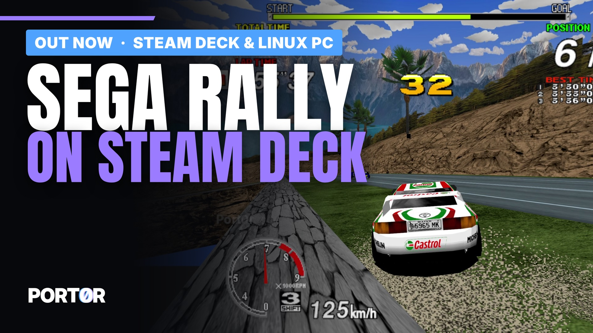
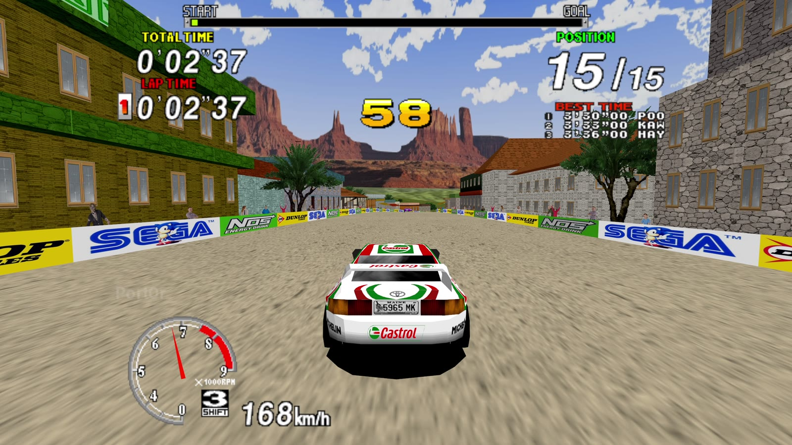
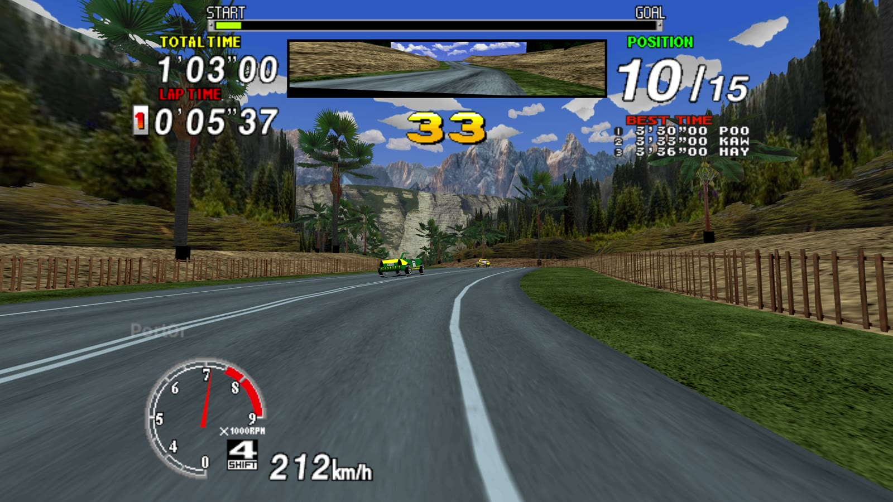
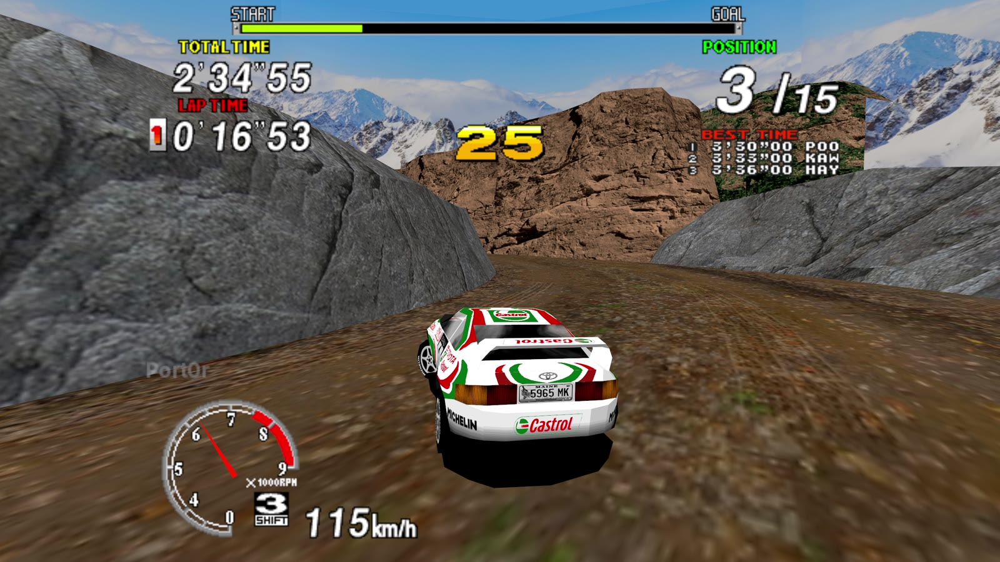
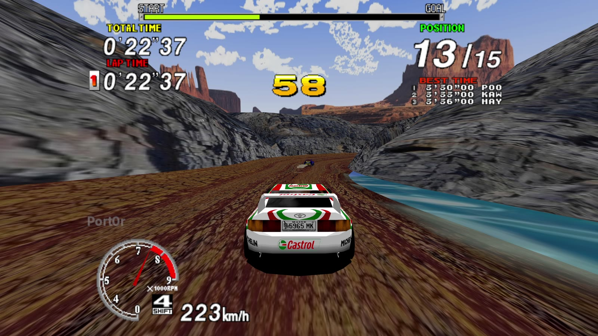
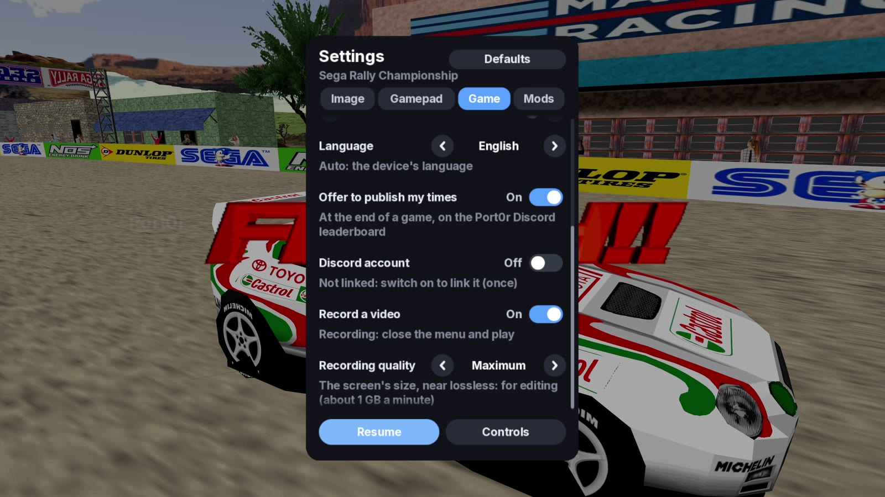
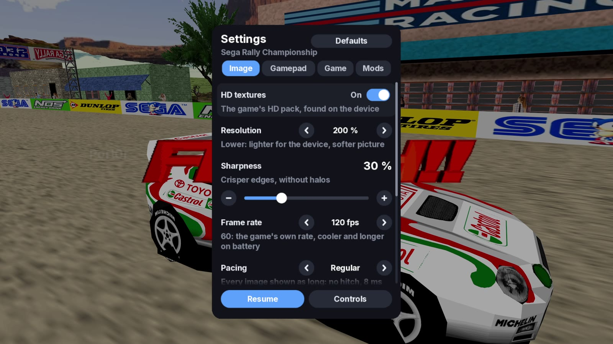

  

  <a href="https://discord.gg/XMk7GgapuN"><b>Discord</b></a> ·
  <a href="https://github.com/jacquesdupontd/port0r/releases/tag/linux-v0.1.0"><b>Download</b></a> ·
  <a href="https://ko-fi.com/port0r"><b>Ko-fi</b></a> ·
  <a href="README.md"><b>Port0r on Meta Quest (VR)</b></a> ·
  <a href="SWITCH.md"><b>Nintendo Switch</b></a> ·
  <a href="ANDROID.md"><b>Android</b></a>

# Sega Rally on Linux and the Steam Deck

**The 1995 arcade Sega Rally Championship on your Linux PC or your Steam Deck, free, from the people who made Port0r:
Rally VR.**

> ### Download Sega Rally for Linux v0.1.0 (free)
> **[Port0r-SegaRally-Linux-v0.1.0.tar.gz](https://github.com/jacquesdupontd/port0r/releases/download/linux-v0.1.0/Port0r-SegaRally-Linux-v0.1.0.tar.gz)**
> from the [release page](https://github.com/jacquesdupontd/port0r/releases/tag/linux-v0.1.0). Nothing to install:
> unpack it and play. Then follow the [install guide](#install). **You bring your own game files.**

The whole track in **true full screen**: the arcade's picture at its full height, HUD included, and the world widened to
fill your screen, at its **native resolution**. Drawn by the same Vulkan renderer as Port0r: Rally VR, at **60, 120, 180
or 240 images a second**, with **supersampling up to 200 %**, **anti-aliasing up to x8**, and a **steady pacing** that
gives every arcade frame exactly the same time on screen. Jean-seb's community **HD textures** if you want them. Keyboard
and **any gamepad**, the **Steam Deck** as a non-Steam game, and your times on the **Port0r Discord leaderboard**.

| Desert | Forest | Mountain |
| --- | --- | --- |
|  |  |  |
| **HD textures** | **Settings** | **Image tab** |
|  |  |  |

*All screenshots: captured on a Linux PC (Radeon RX 7800 XT, 2560x1440), HD textures on.*

---

## Contents

- [What you need](#what-you-need)
- [Install](#install)
- [Controls](#controls)
- [Settings](#settings)
- [Smoothness: 60, 120 Hz and more](#smoothness)
- [HD textures](#hd-textures)
- [The leaderboard on Discord](#the-leaderboard-on-discord)
- [Recording your races](#recording-your-races)
- [Your data](#your-data)
- [Updates](#updates)
- [Troubleshooting](#troubleshooting)
- [Known limits](#known-limits)
- [Help, bugs, support](#help-bugs-support)
- [Credits and legal](#credits-and-legal)

## What you need

- A **Steam Deck** (LCD or OLED), or a **64-bit Linux PC** (an x86_64 processor with SSE4.2: Intel from 2008, AMD from
  2011) with a system
  from 2022 or newer: SteamOS 3, Ubuntu 22.04, Debian 12, Fedora 36, Arch, Mint 21 and their kin (glibc 2.35 or
  newer). The package brings everything else it needs: nothing to install.
- A **Vulkan 1.1** graphics card: AMD or Intel with Mesa (the default on Linux), or NVIDIA with its own driver (not
  tested yet). Tested on a Radeon RX 7800 XT: 120 images a second at 200 % of 1440p, the card a fifth busy.
- **Your own** Sega Rally Championship arcade files, made for **MAME 0.289**: `srallyc.zip` and `segabill.zip`.
  Port0r never includes them and never says where to get them. No ROM requests on the Discord, please.
- Optional: a gamepad (Xbox, PlayStation, 8BitDo and the rest), and Jean-seb's HD texture pack.

## Install

### On a PC

1. **Download** `Port0r-SegaRally-Linux-v0.1.0.tar.gz` and **unpack** it anywhere (for example `~/Games/`).
2. **Put your game files in your Downloads folder**: `srallyc.zip` and `segabill.zip`, **not unzipped**. Anywhere in
   your home folder works too, even in a sub-folder.
3. **Double-click `Port0r Rally.sh`** (or run `./port0r` from a terminal). The game finds your files, copies them by
   itself, and starts.

You can also **drop** a file on the game's window. If a file is missing or not the right version, the start screen names
it and says what to do; it starts as soon as the right files are there.

### On the Steam Deck

1. In **Desktop mode**, download the file, unpack it (for example in `~/Games/`), and put your game files in
   **Downloads** (or on the **SD card**).
2. In **Steam > Games > Add a Non-Steam Game to My Library**, choose **Browse** and pick **`Port0r Rally.sh`** (set the
   file type to "All files" if it is not listed).
3. Go back to **Game mode** and start it from your library. The Deck's controls work as a gamepad, nothing to set up.
4. **Steam Deck OLED**: in the Quick Access menu > **Performance**, set the **refresh rate to 60 Hz** (see
   [Smoothness](#smoothness)).

## Controls

### Keyboard

The keys are read by their **place** on the keyboard: on AZERTY, Z Q S D drive like W A S D.

| Action | Key |
|---|---|
| Steer | Left / Right arrows, or A / D (Q / D on AZERTY) |
| Gas / brake | Up / Down arrows, or W / S (Z / S on AZERTY) |
| Gears (manual cars) | E up, Q down (A on AZERTY) |
| Change view | V |
| Insert a coin | 5 (the cabinet wants two per game) |
| Start | Enter |
| **Pause, the settings** | **Escape** |
| Full screen | F11 (or Alt+Enter) |
| Screenshot | F12 |
| **Record a video** of your race (see [Recording](#recording-your-races)) | **F9** (again to stop) |
| In the settings | Arrows to move and change, Enter to choose, Tab / Shift+Tab or Page Up / Down for the tabs, Escape to close; the mouse works too (click, wheel) |

### Gamepad and Steam Deck

| Action | Button (default) |
|---|---|
| Steer | Left stick (or the right stick, or the d-pad: Settings > Gamepad > Steering) |
| Gas / brake | RT / LT (analog) |
| Gears (manual cars) | RB up, LB down |
| Change view | Y |
| Start | A |
| Insert a coin | Select / View |
| **Pause, the settings** | **Start / Menu** (or the Guide button) |
| In the settings | D-pad or stick to move, left / right to change, LB / RB tabs, A to choose, B to close |

Every action can be moved to another button in **Settings > Gamepad**; two actions never share a button. Every gamepad
plugged in is read at once, and rumbles on the knocks and the landings.

## Settings

Escape or Start pauses the game and opens the settings.

- **Image**: **Resolution** (Auto, 100, 75, 50 %, or **150 / 200 %** supersampling), **Frame rate** (the screen's
  maximum, or 60, 120, 180, 240), **Pacing** (Steady, or Lowest latency), **Anti-aliasing** (off, x2, x4, x8, at the
  next launch), **Full screen**, **Sharpness**, **HD textures**, **Brightness**, **Style** (colour, black and white,
  comic, night).
- **Gamepad**: every button.
- **Game**: vibrations, speed (the arcade's own, or 60 images a second), volume, language (ten languages), the Discord
  leaderboard.
- **Mods** (the Switch build's, same rules): free timer, free play, sporty automatic, adaptive steering, mirrored track,
  telemetry.

## Smoothness: 60, 120 Hz and more

The arcade makes **60 pictures a second**. It looks perfectly smooth when every picture stays on screen for the same
time, which takes a screen running at **60, 120, 180 or 240 Hz**, or with **FreeSync / VRR** on.

- **Steam Deck LCD** (60 Hz): nothing to do.
- **Steam Deck OLED** (90 Hz): set it to **60 Hz** in Performance. At 90 Hz the pictures alternate one and two
  refreshes, a judder however fast the Deck is.
- **PC at 144 or 165 Hz without VRR**: pick a **120 Hz** mode for your screen in your system's display settings, or
  switch VRR on. The game itself is steady; it is the screen's rhythm that does not divide by 60.
- **Pacing > Steady** (the default) holds every arcade picture exactly the same number of refreshes, for about 8 ms of
  added latency. **Lowest latency** removes it, with a rare uneven frame at 120 Hz and above.

## HD textures

Jean-seb's community pack, optional. Leave its zip (any name) or its unpacked folder in your Downloads folder or
anywhere in your home folder: it is set up by itself the next time the game starts. Settings > Image > HD textures
switches it on or off.

## The leaderboard on Discord

At the end of a game, Port0r offers to publish your times (Settings > Game). The first time, it shows a code: link your
Discord once, and your times land in #leaderboard on the [Port0r Discord](https://discord.gg/XMk7GgapuN).

## Recording your races

Port0r records your races itself, ready to share: on the Discord, we want to see your best runs.

- **Start / stop**: **F9**, or the pause menu > **Game** > **Record a video** (the way on a Steam Deck in Game mode, no
  keyboard needed). It is always off when the game starts.
- **While it records**, a red dot blinks at the top right of the screen. It is not in the video.
- **What is recorded**: every arcade picture once, **exactly 60 images a second** whatever your screen's refresh rate,
  at your screen's resolution, menus included, with **the game's sound only** (lossless FLAC), not the rest of your
  desktop.
- **Where**: `~/Videos/Port0r/port0r-YYYYMMDD-HHMMSS.mkv` (your Videos folder, in your language).
- **Recording quality** (same tab, for the next recording):

| Profile | Picture | For |
|---|---|---|
| Maximum | your screen's resolution, near-lossless HEVC (about 1.1 GB a minute at 1440p) | editing your own video |
| **High** (default) | your screen's resolution, HEVC | sharing as it is |
| Balanced | up to 1080p, HEVC | lighter files |
| Light | up to 720p, H.264 | the Steam Deck, a small PC |

The graphics card encodes when it can (VAAPI: AMD, Intel), otherwise the processor (slower). On a Radeon RX 7800 XT at
1440p the game keeps 120 images a second while recording, with no picture lost; if the encoder falls behind, it drops
pictures from the video, never from your game. **It needs ffmpeg** on the computer: without it, the menu says so and
the game carries on. On the Steam Deck, ffmpeg may not be installed by default (not yet checked on a real Deck).

## Your data

Everything lives in `~/.local/share/port0r/srallyc/`: the settings, the game's own copy of your files, the HD pack and
the screenshots (F12). Delete that folder to start from scratch. To keep it elsewhere, start the game with
`PORT0R_DATA=/your/folder`.

## Updates

From now on, the game updates itself. At launch it checks once, in the background, for a new Linux version on GitHub
(never during a race; a failed connection never stops you playing). When there is one, a notice **Version X available**
shows for a few seconds and the settings panel opens on **what's new, before anything is installed**; then **Download
and install**. The download is checked against the release's SHA-256, installed in the game's folder (the previous
version is kept next to it as `<folder>.old`), and the game restarts on the new version. Your settings, records and game
files are kept: they live in your data folder.

- Settings > Game > **Check for updates automatically** switches the launch check off; **Updates > Check now** checks
  whenever you want.
- The game's folder must be writable (it is, wherever you unpacked it in your home folder).
- This first version, v0.1.0, you download by hand; every version after it comes through the game.
- Nothing is sent but the request to GitHub's public release list.

## Troubleshooting

| What you see | What to do |
| --- | --- |
| The start screen lists missing files | Put `srallyc.zip` and `segabill.zip`, not unzipped, in Downloads (or anywhere in your home folder, or on the Deck's SD card). They must be made for MAME 0.289. |
| It says a file is not the right version | Check your files against MAME 0.289 with a ROM manager; put the corrected ones in Downloads: they replace the old ones by themselves. |
| Nothing happens on double-click | Your file manager may open scripts as text: right-click > Run as a program, or run `./port0r` from a terminal to read what it says. |
| It judders although the game is fast | Your screen's refresh rate does not divide by 60: see [Smoothness](#smoothness). |
| "No Vulkan device" | Install your card's Vulkan driver (`mesa-vulkan-drivers` on Ubuntu and Debian, `vulkan-radeon` or `vulkan-intel` on Arch). |
| The Steam Deck's buttons do nothing | In Steam, the game's controller settings: choose the "Gamepad" layout. |
| Stuck anywhere | Ask on the [Discord](https://discord.gg/XMk7GgapuN): #install-help, or the bot in #ask-port0r. |

When you report a bug, start the game from a terminal (`./port0r`) and join what it prints.

## Known limits

- First Linux version: tested on a desktop PC (Ubuntu 26.04, Radeon RX 7800 XT, 2560x1440 165 Hz, Xbox One S
  gamepad, keyboard) and under gamescope, the Steam Deck's own compositor, at its 1280x800. **Not yet on a real Steam
  Deck: Deck owners, tell us how it goes** on the Discord, we fix fast.
- NVIDIA and Intel graphics: expected to work through their Vulkan drivers, not yet tested.
- 120 images a second are the arcade's 60 each shown twice, perfectly even; truly new in-between pictures are not made
  yet.
- Racing wheels (Logitech G29 and others) are read as gamepads, not yet tuned.

## Help, bugs, support

- **Discord**: https://discord.gg/XMk7GgapuN (#install-help, #bugs, #wishes, #leaderboard)
- **Bugs**: #bugs, or a [GitHub issue](https://github.com/jacquesdupontd/port0r/issues) with your distribution, your
  graphics card, and what `./port0r` printed.
- **Support the project**: [Ko-fi](https://ko-fi.com/port0r), or just share it, it helps a lot.

## Credits and legal

- HD textures: Jean-seb.
- Built on MAME (GPL) and SDL. Port0r: a free fan project, by the same people as [Port0r on Meta Quest](README.md)
  (arcade games in true 3D VR), [Sega Rally on Nintendo Switch](SWITCH.md) and [on Android](ANDROID.md).

Sega Rally Championship is a trademark of SEGA. Steam and Steam Deck are trademarks of Valve. Port0r is not affiliated
with SEGA or Valve. No game files are included, ever.
