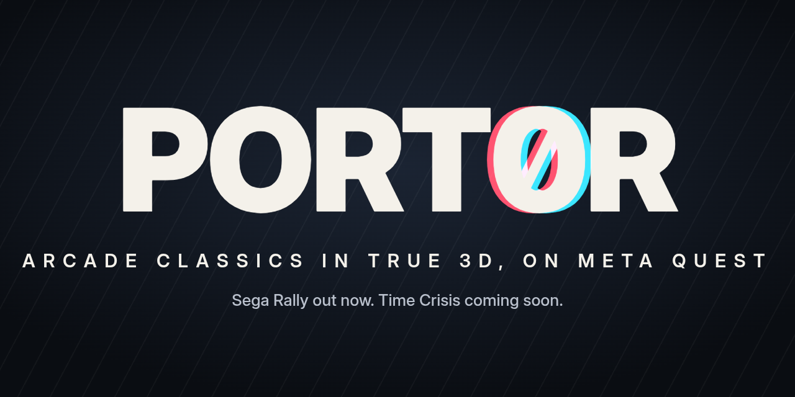
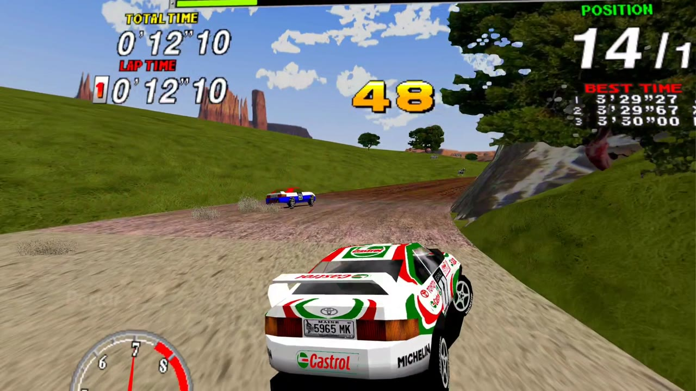
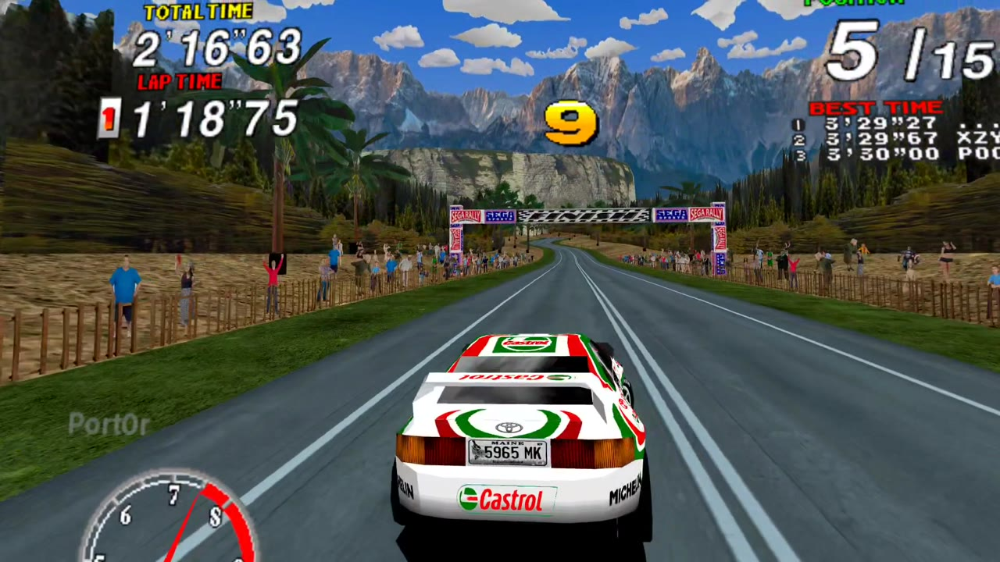
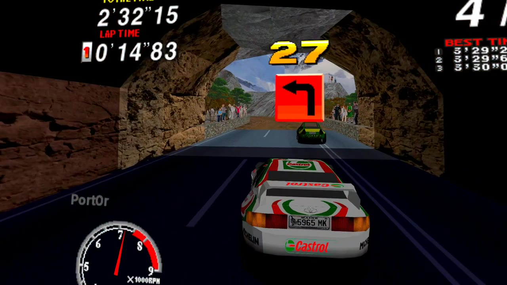
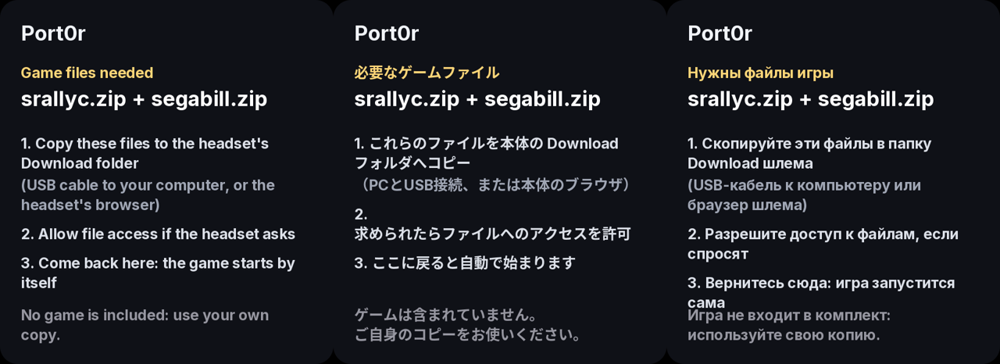
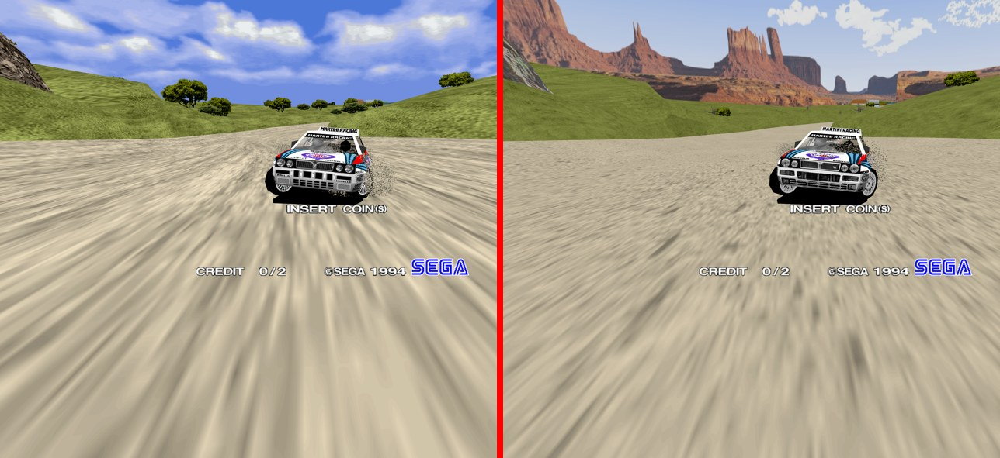
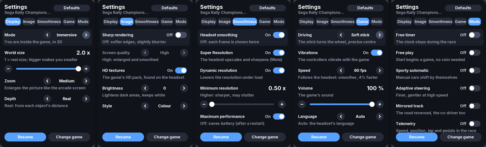
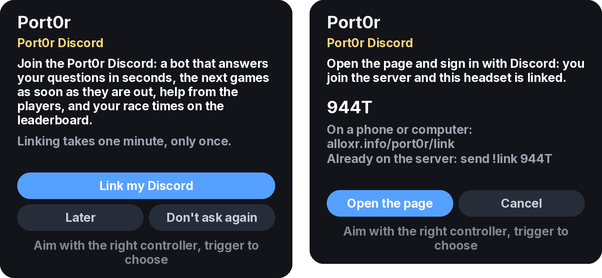
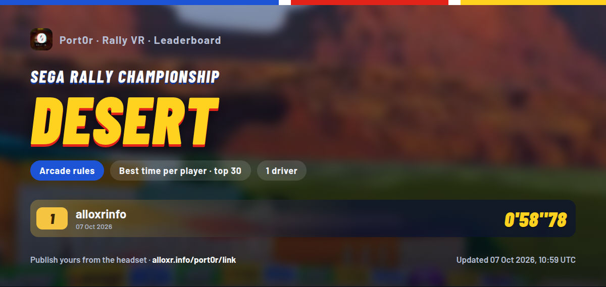

<p align="center">
  <a href="https://github.com/jacquesdupontd/port0r/releases/latest"></a>
  <a href="https://github.com/jacquesdupontd/port0r/releases/tag/switch-v0.5.1"></a>
</p>

<p align="center">
  <a href="https://discord.gg/XMk7GgapuN"><b>Discord</b></a> ·
  <a href="../../releases"><b>Download</b></a> ·
  <a href="https://ko-fi.com/port0r"><b>Ko-fi</b></a> ·
  <a href="https://github.com/sponsors/jacquesdupontd"><b>Sponsor</b></a> ·
  <a href="https://www.youtube.com/watch?v=FqwEK0hJ_Yc"><b>Video</b></a>
</p>

# Port0r

**Arcade classics in true stereoscopic 3D, on Meta Quest.** And now Sega Rally on Nintendo Switch too ([below](#install-sega-rally-switch)).

> ### Download Port0r: Rally VR v0.2.2 (free)
> **[Port0r-RallyVR-v0.2.2-quest3.apk](https://github.com/jacquesdupontd/port0r/releases/download/v0.2.2/Port0r-RallyVR-v0.2.2-quest3.apk)** (Meta Quest 3), from the [releases page](https://github.com/jacquesdupontd/port0r/releases/latest), also on [itch.io](https://port0r.itch.io/rally-vr).
> Then follow the [install guide](#install-port0r-rally-vr) below: about ten minutes the first time. You bring your own game files.
> **On Nintendo Switch:** [Port0r-SegaRally-Switch-v0.5.1.zip](https://github.com/jacquesdupontd/port0r/releases/download/switch-v0.5.1/Port0r-SegaRally-Switch-v0.5.1.zip) (homebrew), [install guide](#install-sega-rally-switch).
> The app's own source code is not public for now: this repository holds the releases, the guide and the issue tracker.

Not a flat screen floating in a dark room. Port0r takes the real 3D scene the arcade board draws, rebuilds it for each
of your eyes and puts you inside it, at real scale. The car sits in front of you, the hills have volume, the trees
pass by your shoulder, the speed is physical. Be inside the arcade, not in front of it.

[](https://www.youtube.com/watch?v=FqwEK0hJ_Yc)

| Desert | Forest (HD textures) | Mountain |
| --- | --- | --- |
|  |  |  |

---

## Releases

| Game | Board | Status |
| --- | --- | --- |
| **Port0r: Rally VR** (Sega Rally Championship) | Sega Model 2A, 1995 | **Out now, v0.2.2** ([Releases](../../releases), [itch.io](https://port0r.itch.io/rally-vr); SideQuest: waiting for approval, very soon) |
| **Sega Rally on Switch** (homebrew) | Sega Model 2A, 1995 | **Out now, v0.5.1** ([Release](https://github.com/jacquesdupontd/port0r/releases/tag/switch-v0.5.1), [install guide](#install-sega-rally-switch)) |

**Headsets:** Meta Quest 3 is the reference. A player reports that it runs perfectly on Quest 2 too.

## Upcoming

Every game below already runs in the headset, in true 3D. They come out one at a time, when they are right.

- **Time Crisis** (Namco System 22, 1995), *next*: fully immersive 3D at 120 Hz, rendered on the headset's GPU at full
  speed, real VR aiming where your gun points, with a detailed 3D gun in your hand.
- **Virtua Cop** (Sega Model 2, 1994): immersive 3D at full arcade speed (57.5 images a second instead of 49), aiming
  checked against what is really drawn (menus included), a crosshair you can toggle, enemies at cabinet scale.
- **Daytona USA** (Sega Model 2, 1994): longer draw distance, complete track sides when you look around, full-detail cars
  in the distance, no scenery popping; community HD texture pack support.
- **The House of the Dead** (Sega Model 2A, 1996): immersive 3D indoors, the HUD split between your gun and a panel.
- **Sega Super GT 24h** (Jaleco, Model 2B): full speed (it ran at 82 to 93 %), 120 images a second in races.
- **Top Skater** (Sega Model 2C, 1997): its 3D displays correctly (it was broken even in the reference emulator),
  skateboard controls.
- **Virtua Racing** (Sega Model 1, 1992): the arcade's 30 images a second smoothed to the headset's rate, longer draw
  distance, all four arcade cameras.
- **Dirt Dash** (Namco System 22, 1995): immersive 3D at 120 Hz.
- **Time Crisis II** (Namco System 23, 1997): full speed, immersive 3D.

---

<a id="install-sega-rally-switch"></a>

## Sega Rally on Nintendo Switch (new, v0.5.1)

The same arcade Sega Rally, as a homebrew for a Switch running custom firmware (Atmosphère): the whole track in full
16:9, Jean-seb's HD textures (optional), a Workshop with 10 mods, best-lap ghost, named replays, photo mode, 10
languages, and your times on the Discord leaderboard.

**Download:** [Port0r-SegaRally-Switch-v0.5.1.zip](https://github.com/jacquesdupontd/port0r/releases/download/switch-v0.5.1/Port0r-SegaRally-Switch-v0.5.1.zip)
from the [Switch release page](https://github.com/jacquesdupontd/port0r/releases/tag/switch-v0.5.1). You bring your own
game files (MAME 0.289), nothing else is included.

### 1. Copy the files

Unzip `Port0r-SegaRally-Switch-v0.5.1.zip` and copy its content to the **root of the SD card**, keeping the folders.
The game lands in:

```
/switch/segarally/gpt61sol/segarally.nro
```

Updating: copy the new `segarally.nro` over the old one; your settings, records, replays, ghosts and cache stay.

### 2. Add your game files

Put `srallyc.zip` and `segabill.zip` (**do not unzip them**) in:

```
/switch/segarally/gpt61sol/roms/
```

A merged set that already contains `epr-18022.ic2` (Sega Billboard) does not need the separate `segabill.zip`.

If a file is missing or wrong, the start screen names the files and the folder to put them in; **A** searches again.
To replace a wrong set, drop the new zip in `/Download/` (up to three sub-folders): a different size or a newer date
is copied over the old one automatically at the next launch.

### 3. Optional: the HD texture pack (by Jean-seb)

Extract it to:

```
/switch/segarally/gpt61sol/texpack/srallyc/
```

`srallyc.pat` and the images must be **directly** in that folder (no extra sub-folder). A pack zip placed in
`/Download/` is found and extracted there automatically. Without it, **B** plays with the original textures and
**Y** stops asking. The first launch with HD builds a cache: keep it when you update.

### 4. Launch it in application mode

Hold **R** while opening any installed game to get the Homebrew Menu with full memory, then choose Sega Rally.
Opening it from the Album alone may run out of memory.

#### Optional: a Sega Rally tile on the HOME screen

The zip has a small launcher (`tile-home/SegaRally-0100534552000000.nsp`, title ID `0100534552000000`). It holds no
game data: it only opens the NRO. Install it with your usual NSP installer, and copy the two text files of the zip to:

```
/atmosphere/contents/0100534552000000/romfs/nextNroPath
/atmosphere/contents/0100534552000000/romfs/nextArgv
```

### 5. Controls

| Action | Button |
|---|---|
| Steer | Left stick (or the right stick: Workshop > Driving) |
| Gas / brake | ZR / ZL, or the other stick up / down |
| Gears (manual cars) | L down, R up |
| Start | + |
| Insert a coin | − (or click the right stick) |
| Change view | X / Y |
| Handbrake | Click the left stick |
| **Workshop (settings, mods, replays) and pause** | **+ and − together** |
| Quit cleanly | Hold ZL + ZR + R for 2 seconds |

Steering sensitivity: 22 % is the reference, 50 % reaches both ends of the arcade wheel.

### 6. The Workshop (+ and −)

Ten languages, steering stick, brightness, automatic or fixed resolution, original speed or 60 fps, 10 mods (free play,
mirrored track, night, comic book, black and white, CRT...), picture styles, practice ghost, named replays, photo mode.

### 7. Replays

Workshop > REPLAYS > Record a new race, then play. **Name and save** keeps it (40 characters max). Replays are saved
inputs (`.srr`), not videos: replay them in the game, export them to `/switch/segarally/gpt61sol/replays/exports/`,
or import someone's `.srr` into `replays/` (same version and same game files needed). To make a video of a replay,
record the Switch's HDMI output with a capture card.

### 8. Online leaderboard (Port0r Discord) — new, please report problems

Workshop > Share > Discord shows a code. On your phone or computer, send `!link CODE` in any channel of the
[Port0r Discord](https://discord.gg/XMk7GgapuN) or in a private message to the bot. Nothing to install on the Switch.
After a real race the game asks before publishing your time (replays and free-run times are never published).
"Forget the account" removes the link. This is the first public version of the Switch link: if anything goes wrong,
tell us in #bugs.

### Help

- Ask on the [Port0r Discord](https://discord.gg/XMk7GgapuN) (#install-help, or the bot in #ask-port0r).
- Bugs: #bugs on Discord, or a GitHub issue.

---

## This is not a one-click port

People sometimes think a VR port is a setting you switch on. It is not. Sega Rally VR alone is months of evenings and
nights of work, game by game, frame by frame, checked in the headset. Here is what it took, in player terms.

**A new renderer for the arcade board.** The arcade game runs on its own code through an emulator, but the picture you
see is not the emulator's: every 3D polygon the Sega Model 2 board draws is taken and redrawn on the Quest's GPU, for
each eye, with the board's own rules re-implemented one by one: its textures and palettes, its lighting tables, its
transparency, its "checker" glass, the order in which it paints the screen. That is how the colours are the arcade's
exact colours, and how details like the moving sky reflection in the creek after the Desert checkpoint look like the
cabinet.

**Real stereoscopic 3D, at real scale.** The scene is re-projected for each eye from the game's own camera, at the size
it really is: one metre in the game is one metre around you. The game was never made for two eyes, so a lot of work
went into what that breaks: the HUD (speed, time, gear) sits on a comfortable plane instead of floating inside the
scenery, the speedometer needle stays inside its dial, screen-wide effects cover your whole view, letterbox bands
vanish, nothing makes your eyes cross.

**Rock-solid smoothness.** The arcade runs at 60 images a second, the headset at 120 Hz. The game is locked to the
headset and every arcade image is shown exactly once, with the headset filling in the frames between: no stutter, no
judder on the car in the corners. The picture is rendered above the headset's own resolution and smoothed by the headset
on the way to the screen; dynamic resolution lowers it for a moment only when a scene gets too heavy.

**Controls that feel right.** Analog steering with a precise centre, triggers for the pedals, a real manual gearbox on
the side grips (the manual cars could not even be driven at first), and vibrations read from the game's own physics:
you feel the wall hits, the jumps and landings and the contacts with other cars, and nothing in a normal corner.

**HD textures.** The app reads the community HD texture packs made for the Model 2 Emulator, as they are: drop Jean-seb's
pack on the headset and it is found, imported and used, with nothing to configure.

**Everything a player needs, inside the headset.** The game files are found wherever you copied them, the app starts by
itself, your records are saved, a settings panel floats next to the game, in your language.

**The mods.** The extra modes of our Sega Rally homebrew for the Nintendo Switch, brought to VR: free timer, free play,
sporty automatic gearbox, adaptive steering, a mirrored track with the co-driver's calls mirrored too, telemetry, and
picture styles.

All of it is free. If you enjoy it, see [Support the project](#support-the-project).

---

## Bring your own game files

**No game data is included.** You need your own, legally owned copy of the arcade game. We never provide, link to or
discuss where to download game files: please don't ask, on Discord or anywhere else.

For Port0r: Rally VR, the files are the MAME set `srallyc.zip` and `segabill.zip`. `segabill.zip` is only needed if your `srallyc.zip` does not already include the billboard ROM (some sets do; the app checks).

**The set must match a recent MAME (Port0r runs MAME 0.289).** Sets made for older MAME versions can have different files inside and won't start. If yours is old, check it against a recent MAME with a ROM manager such as ClrMamePro or RomVault.

## Install (Port0r: Rally VR)

About ten minutes the first time. You need a computer (Windows, Mac or Linux) or just the headset's browser, a USB-C
cable helps.

### 1. Turn on Developer Mode (once)

Developer Mode is what lets a Quest install apps that are not from the Meta store.

1. Create a (free) developer organisation at [developer.oculus.com](https://developer.oculus.com/manage/organizations/create/)
   with the same Meta account as your headset. Meta asks for this once.
2. On your phone, open the **Meta Horizon** app > **Devices** > your headset > **Headset settings** > **Developer mode**,
   and switch it on.
3. Restart the headset.

### 2. Install the APK

Download `Port0r-RallyVR-v0.2.2-quest3.apk` from [Releases](../../releases) or [itch.io](https://port0r.itch.io/rally-vr)
(a SideQuest store listing is waiting for approval and will follow very soon), then pick one way:

- **SideQuest** (easiest): install [SideQuest](https://sidequestvr.com/setup-howto) on your computer, plug the headset
  in with a USB-C cable, put the headset on and accept **"Allow USB debugging"** (tick *Always allow*). In SideQuest the
  dot at the top left turns green: click the **"Install APK file from folder"** icon (top right) and pick the APK.
- **adb** (if you already use it): `adb install -r Port0r-RallyVR-v0.2.2-quest3.apk`

The APK checksum is in `SHA256SUMS.txt` next to it, if you want to check your download.

### 3. Put your game files on the headset

The files are `srallyc.zip` and, only if your set needs it, `segabill.zip` (see above). The **Download** folder is the
usual place, but the app looks everywhere on the headset's storage, and the names are not case sensitive. Pick one way:

- **SideQuest**: the folder icon (top right) opens the headset's files. Open `Download` and drag your zips in.
- **USB cable, no software**: plug the headset in, put it on and accept **"Allow access to data"** (without it, the
  headset shows up empty). It appears as **Quest 3 > Internal shared storage**: copy the zips into `Download`.
  On a **Mac**, Finder does not show Android devices: use [OpenMTP](https://openmtp.ganeshrvel.com) (free) or Android
  File Transfer.
- **The headset's browser**: anything you download in the Quest browser lands in `Download`. Handy with a file you keep
  in your own cloud storage (Google Drive, Dropbox...). The phone's Meta Horizon app cannot copy files to the headset.

### 4. First launch

1. Put the headset on: **Library** > the filter at the top (*All*) > **Unknown sources** > **Port0r: Rally VR**.
2. The first time, the headset asks for **"All files access"**: allow it. The app only reads its game files and the
   optional HD texture pack.
3. Come back to the app: the game is copied in and starts by itself. Until then, a screen in your language tells you
   which files are missing.



**Updating:** install the new APK over the old one; your settings and records are kept. From v0.1.0 (another app id):
uninstall it first, your game files stay on the headset.

## HD textures (optional)

The community HD texture pack for Sega Rally is made by **Jean-seb**. Get it from his video
["Sega Rally Championship HD textures pack : new version"](https://www.youtube.com/watch?v=K1d4jO6rP2Y) (the download
link is in its description) and put his zip, or the extracted folder, on the headset next to the game files. The app
finds it, imports it, and the HD textures are on from the next launch (Image > HD textures switches them off).

Without a pack, the app offers it once per launch, with a **"Don't ask again"** choice if you prefer the original look.
We never ship the pack: all credit goes to Jean-seb, please support his work.



## Controls

| Action | Button |
| --- | --- |
| Steering | Left stick (or the right stick: settings panel > Game > Steering stick; the grips then shift gears) |
| Gas / brake | Right trigger / left trigger |
| Gears (manual cars) | Side grips: left = down, right = up (the right stick up/down works too) |
| Change view | A or B |
| Insert a coin / Start | X (left controller) / B (or click the left stick) |
| Settings panel | Left menu button (aim with the right controller, trigger or A to click) |
| Pause / resume | Click both thumbsticks together (same again to resume) |
| Recenter the view | Y on the left controller (or hold the Meta button of the right controller for 2 s) |

## The settings panel

Everything is set inside the headset, in a panel that floats next to the game. **Defaults** restores the values we
tuned. A tab longer than the panel scrolls (either thumbstick, or drag the bar on the right with the laser), and the
**Controls** button at the bottom lists every button of the game, in your language.



**Display**
- **Mode**: *Immersive* (you are inside the game, in 3D; the default), *3D window* (an arcade screen in 3D) or *Flat
  screen* (the arcade screen, flat).
- **World size**: 1 = real size; bigger makes you smaller. 2 by default, where the eyes are most comfortable.
- **Zoom**: enlarges the picture like the arcade screen does (Auto, None, Low, Medium, Strong).
- **Depth**: *Real* (from each object's real distance) or *Arcade order* (the board's own drawing order).

**Image**
- **Sharp rendering**: crisp edges; off gives softer, slightly blurrier edges.
- **Screen quality**: *High* (the arcade screen enlarged and smoothed) or *Native*.
- **HD textures**: uses the HD pack when one is on the headset.
- **Resolution**: *Native* (the headset's own resolution), *High* (the default: smoother edges) or *Maximum*. Above
  Native the headset smooths the picture down to its screen; dynamic resolution lowers it for a moment if a scene is
  too heavy.
- **Brightness**: lightens the dark areas, keeps the white.
- **Style**: *Colour* (the arcade's), *Black & white*, *Comic* (a flat, inked look) or *Night*.

**Smoothness**
- **Headset smoothing**: the headset fills in the frames between the arcade's (off: each frame is shown twice).
- **Super Resolution**: Meta's sharpening, used when the picture is below Native. Above it the headset always smooths the
  edges instead (sharpening there would make fine details shimmer).
- **Dynamic resolution** and **Minimum resolution** (0.5 by default): keep the frame rate locked in heavy scenes.
- **Maximum performance**: the headset's highest clocks (off saves battery, after a restart).

**Game**
- **Steering stick**: *Left* (the default) or *Right*: the right stick steers, the side grips shift gears.
- **Driving**: *Soft stick* (precise centre), *Direct stick*, or *VR wheel* (hold an imaginary wheel with both hands).
- **Vibrations**: on or off.
- **Speed**: *Original* (the arcade's exact rate) or *60 fps* (follows the headset: smoother, 4 % faster).
- **Volume**.
- **Language**: *Auto* follows the headset; or English, Français, Deutsch, Español, Italiano, Português, Русский, 日本語,
  简体中文, 한국어.
- **Offer to publish my times**: at the end of a game, the card that offers your times for the Discord leaderboard.
- **Discord account**: shows the account this headset is linked to; switch it on to link one, off to forget it.

**Mods** (all off by default: the cabinet as it is)
- **Free timer**: the clock stops during the race. Drive as long as you like.
- **Free play**: Start begins a game, no coin needed.
- **Sporty automatic**: the manual cars shift by themselves, at sporty shift points.
- **Adaptive steering**: finer around the centre, gentler at high speed.
- **Mirrored track**: the whole track left for right, with the steering mirrored and the co-driver's "left" and "right"
  calls swapped (compound calls rebuilt from the original recordings) and the navigation arrows turned the right way.
- **Telemetry**: a bar under the HUD during the race: speed, position, lap, gas and brake.

## The leaderboard on Discord

Your race times can go on the **#leaderboard** channel of the Port0r Discord, with your Discord name. Nothing is ever
published unless you link your account yourself, and you choose each time.

1. **Link your Discord, once.** The headset offers it at launch (or *Game > Discord account*). It shows a 4-letter code:
   press **Open the page** to sign in with Discord in the headset's browser, or go to
   **[alloxr.info/port0r/link](https://alloxr.info/port0r/link)** on your phone or computer and type the code. Signing in
   joins you to the Port0r server and links the headset in one step. Already on the server? Send `!link CODE` to the
   bot instead. Discord only tells us your name.
2. **Race.** When the game is back to its demo (after the name entry), the headset offers the stages you finished.
   Publish, and they are on the board a few seconds later, with a word from the co-driver.



Each course has its own board, pinned in the channel and redrawn with every new time: the best time of each player, top
30. Times set with the sporty automatic gearbox or the adaptive steering go on a separate *With aids* board, mirrored
runs on a *Mirrored* one, and the free timer is never published.



## Saves

Your records and the cabinet's own settings are saved on the headset while you play (every few seconds) and kept
across updates.

## Known issues

- Driving on grass does not vibrate yet.
- The trees of the attract intro, hidden behind the title panel on the cabinet, can be seen from inside the scene.

## Roadmap

- **Time Crisis** (light gun, 120 Hz, real VR aiming): coming soon.
- **Championship board**: the arcade's real ranking, the total time of the three stages.
- **Cockpit view**: a steering wheel and hands in the car, following your steering. Later, your real wheel in
  augmented reality.
- **Arcade hall**: play on the cabinet itself, standing in a virtual arcade.
- **Comfort mode**: a gentle darkening of the edges in tight corners and big hits, for players sensitive to motion.
- **Sunset style**, **best-lap ghost car**, **replays**, **spectator mode** (freeze the race and walk around the car).
- More games, one at a time.

## Community

Join the **[Port0r Discord](https://discord.gg/XMk7GgapuN)**: release news, setup help, bug reports, game requests and
your videos.

- **Ask the bot.** In `#ask-port0r`, our assistant knows the whole project (install, settings, mods, HD textures, every
  game in progress) and answers in a couple of seconds, in your language, day and night. Try it before you ask: it is
  usually right, and it is honest when it does not know.
- **Be kind.** Be polite, read `#rules`, stay on topic, no ROM requests or links, ever.
- **Help each other.** Answer a newcomer in `#install-help`, share your setup and your clips in `#showcase`. A community
  that helps itself is what keeps a free project alive.

## Videos, streams and reviews

Make all the videos, streams and reviews you like, monetised ones included: that is how a free project gets known.
If you can, put a link to this page (or to [port0r.itch.io/rally-vr](https://port0r.itch.io/rally-vr)) in the
description, or just say the name, Port0r. It is not an obligation, only a big help, and thank you. If you show the HD
textures, a word for Jean-seb, who made them, is welcome too.

## Support the project

Port0r is a one-person project, and lately it takes all of my free time. It is free and will stay free: no paywall, no
donor-only game, no early access for money.

If you enjoy it, any help is more than welcome:

- **Share it.** Post your clips, tell a friend, star this repository. It costs nothing and it matters a lot.
- **Buy me a coffee** on [Ko-fi](https://ko-fi.com/port0r), once or monthly.
- **Sponsor it** on [GitHub Sponsors](https://github.com/sponsors/jacquesdupontd), once or monthly (your name in the
  Sponsors list below and the Sponsor role on Discord, from $5). *The profile is waiting for GitHub's approval: it opens
  any day now. Until then, Ko-fi is the way.*

Donations support the engine's development. They are not a purchase of any game.

## Troubleshooting

- **The app is not in my Library.** Look under the filter at the top of the Library: *All* > **Unknown sources**. If
  that entry is missing, Developer Mode is off or the headset was not restarted after turning it on.
- **SideQuest stays orange / red.** Put the headset on and accept "Allow USB debugging" (tick *Always allow*); try
  another USB-C cable (some only charge).
- **My computer shows the headset as empty.** Put the headset on and accept "Allow access to data", then unplug and plug
  it again.
- **The app keeps saying files are missing.** Check the names (`srallyc.zip`, and `segabill.zip` only if asked), that
  they are zips (not extracted folders), and that "All files access" is allowed: *Settings > Apps > Port0r: Rally VR >
  Permissions*.
- **"Wrong version of the game files".** Your files are on the headset, but they aren't a set for MAME 0.289: the page
  lists the files that are missing or don't match. Check your `srallyc.zip` (and `segabill.zip`) against MAME 0.289
  with a ROM manager (ClrMamePro, RomVault), put the corrected files in `Download` in place of the old ones, and come
  back to the app: it picks them up and the game starts by itself.
- **(v0.2.0 only) I pick Sega Rally, press A, land in a settings panel, and Resume brings me back.** Same cause: the
  files don't load. Update to the latest version, which says it plainly, or uninstall and reinstall the app after
  fixing your files (v0.2.0 never replaced the copy it made the first time).
- **The controllers do nothing.** Restart the headset (hold the power button > Restart).
- **The game stutters.** Check that *Dynamic resolution* is on (*Smoothness* tab), or set *Resolution* to *Native*.
- **Still stuck?** Ask the bot in `#ask-port0r` on [Discord](https://discord.gg/XMk7GgapuN): it knows this whole page
  and answers in seconds, in your language.

## Report a bug

Open an issue with your headset model, the app version (shown in the store listing), what you did and what you saw. A
short video or a photo through the lens helps a lot. You can also post in `#bugs` on Discord.

## Credits

- **Jean-seb**: the Sega Rally Championship HD texture pack, used with credit and never redistributed.
- The **MAME** developers: the emulation the games run on (the BSD-3-Clause parts we use).
- The **Khronos OpenXR** SDK, **zlib**, **expat**, **FLAC**, **zstd** and the other open-source components listed in
  `THIRD-PARTY-NOTICES.txt` (shipped with every release and inside the app).
- The **Inter** and **Noto Sans CJK** typefaces (SIL Open Font License).

## Legal

Port0r is a free, non-commercial fan project. It is **not affiliated with, endorsed by or connected to SEGA, Namco,
Meta or any rights holder.** All trademarks and game content belong to their owners. No game data is distributed.

Port0r's own source code is not public for now. The open-source components it uses are listed, with their licenses, in
`THIRD-PARTY-NOTICES.txt`.

---

## Download

**[Port0r-RallyVR-v0.2.2-quest3.apk](https://github.com/jacquesdupontd/port0r/releases/download/v0.2.2/Port0r-RallyVR-v0.2.2-quest3.apk)**, free, from the [releases page](https://github.com/jacquesdupontd/port0r/releases/latest) or [itch.io](https://port0r.itch.io/rally-vr). Install guide: [above](#install-port0r-rally-vr). Help: [Discord](https://discord.gg/XMk7GgapuN).
