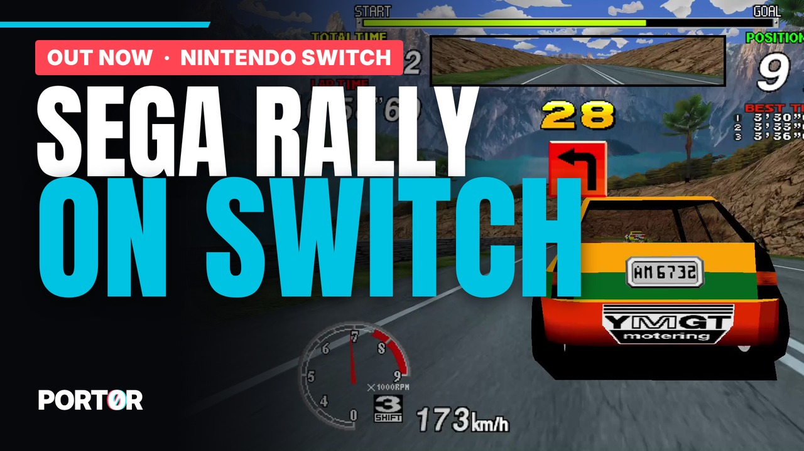

<p align="center">
  <a href="https://github.com/jacquesdupontd/port0r/releases/tag/switch-v0.5.1"></a>
</p>

<p align="center">
  <a href="https://discord.gg/XMk7GgapuN"><b>Discord</b></a> ·
  <a href="https://github.com/jacquesdupontd/port0r/releases/tag/switch-v0.5.1"><b>Download</b></a> ·
  <a href="https://port0r.itch.io/sega-rally-switch"><b>itch.io</b></a> ·
  <a href="https://ko-fi.com/port0r"><b>Ko-fi</b></a> ·
  <a href="README.md"><b>Port0r on Meta Quest (VR)</b></a>
</p>

# Sega Rally on Nintendo Switch

**The 1995 arcade Sega Rally Championship, as a free homebrew for a Switch running custom firmware.**

> ### Download Sega Rally for Switch v0.5.1 (free)
> **[Port0r-SegaRally-Switch-v0.5.1.zip](https://github.com/jacquesdupontd/port0r/releases/download/switch-v0.5.1/Port0r-SegaRally-Switch-v0.5.1.zip)**
> (the game, the optional HOME tile and the install guide), from the
> [release page](https://github.com/jacquesdupontd/port0r/releases/tag/switch-v0.5.1), also on
> [itch.io](https://port0r.itch.io/sega-rally-switch). Then follow the [install guide](#install) below: about ten
> minutes the first time. **You bring your own game files.**

The whole track in **full 16:9**, wider than the cabinet ever showed. Jean-seb's community **HD textures** if you want
them. A **Workshop** with 10 mods, picture styles, a best-lap ghost, named replays and a photo mode. Steer with the
left or the right stick. And your times on the **Port0r Discord leaderboard**.

| Desert | Forest | Tunnel |
| --- | --- | --- |
| 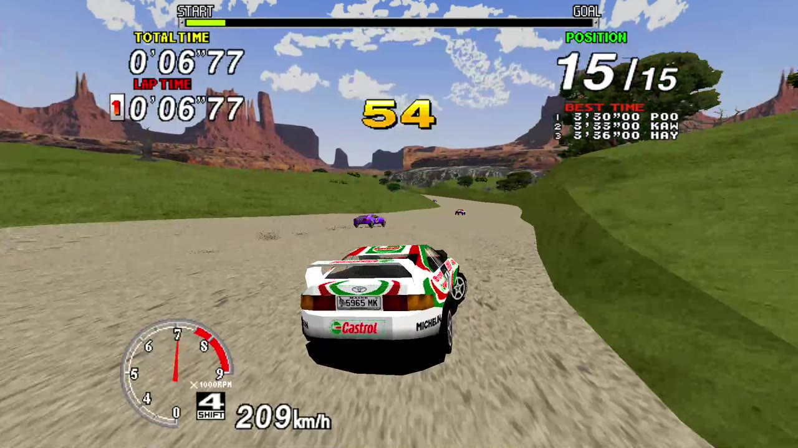 | 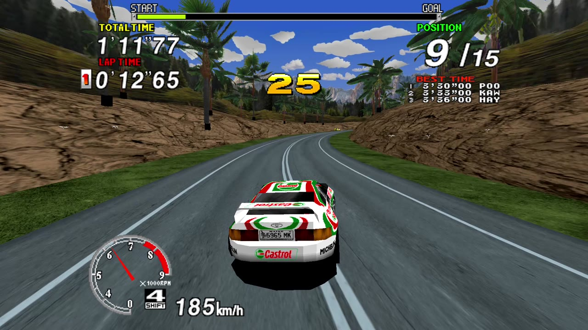 | 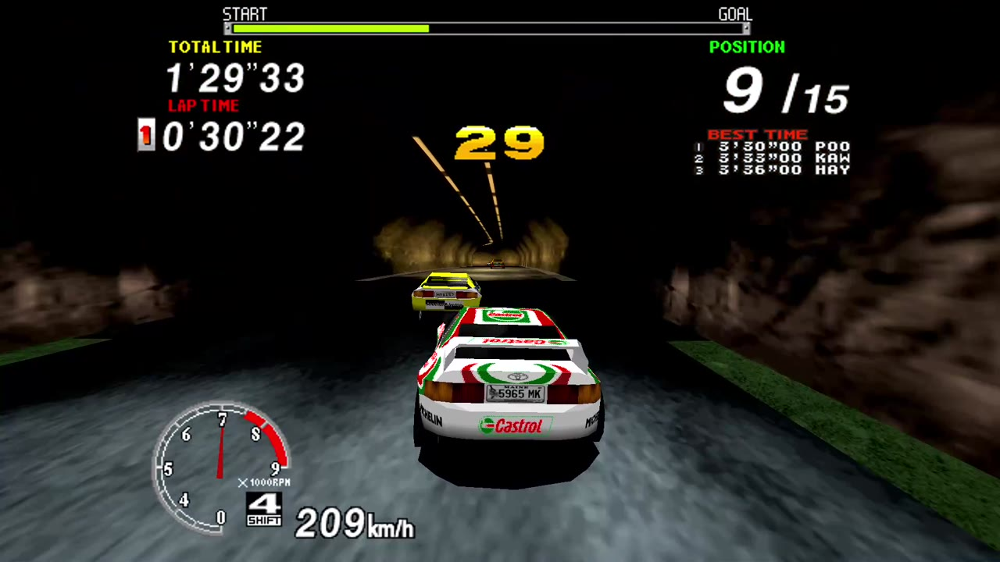 |
| **Lake** | **Mountain** | **Village** |
| 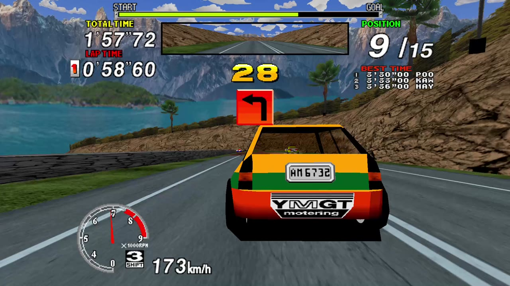 | 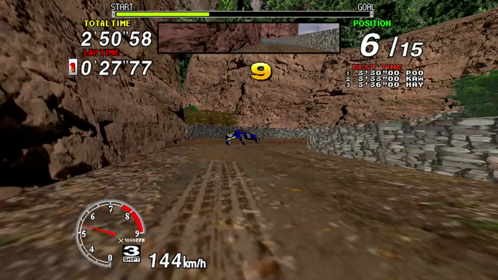 | 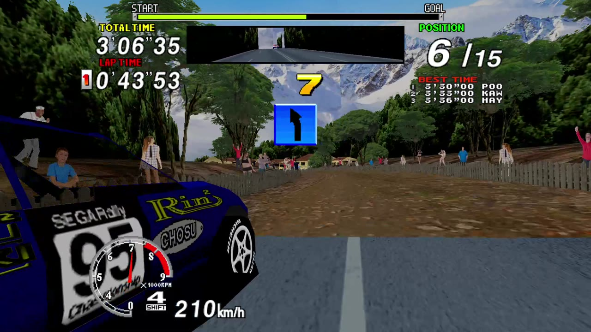 |

*All screenshots: captured from a real Switch (docked, 1080p), HD textures on.*

---

## Contents

- [What you need](#what-you-need)
- [Install](#install)
- [Controls](#controls)
- [The Workshop (+ and − together)](#the-workshop)
- [Replays](#replays)
- [HD textures](#hd-textures)
- [The leaderboard on Discord](#the-leaderboard-on-discord)
- [Saves, settings and updates](#saves-settings-and-updates)
- [Troubleshooting](#troubleshooting)
- [Known limits](#known-limits)
- [Help, bugs, support](#help-bugs-support)
- [Credits and legal](#credits-and-legal)

## What you need

- A Nintendo Switch running custom firmware (**Atmosphère**) with the Homebrew Menu. Port0r does not help with that
  part: see the community guides.
- **Your own** Sega Rally Championship arcade files, made for **MAME 0.289**: `srallyc.zip` and `segabill.zip`.
  Port0r never includes them and never says where to get them. No ROM requests on the Discord, please.
- Optional: Jean-seb's HD texture pack.

<a id="install"></a>

## Install

### 1. Copy the files

Unzip `Port0r-SegaRally-Switch-v0.5.1.zip` on your computer and copy **its content** to the **root of the SD card**,
keeping the folders. You get:

```
/switch/segarally/gpt61sol/segarally.nro                     the game
/tile-home/SegaRally-0100534552000000.nsp                    optional HOME tile (step 5)
/atmosphere/contents/0100534552000000/romfs/nextNroPath      for the HOME tile
/atmosphere/contents/0100534552000000/romfs/nextArgv         for the HOME tile
/INSTALL.md                                                  this guide
```

### 2. Add your game files

Put `srallyc.zip` and `segabill.zip` (**do not unzip them**) in:

```
/switch/segarally/gpt61sol/roms/
```

A merged set that already contains `epr-18022.ic2` (Sega Billboard) does not need the separate `segabill.zip`. The
older folder `/switch/segarally/roms/` is read too.

### 3. Optional: the HD textures

Extract the pack to `/switch/segarally/gpt61sol/texpack/srallyc/` (see [HD textures](#hd-textures)).

### 4. Launch it in application mode

**Hold R while opening any installed game**: the Homebrew Menu opens with the console's full memory. Choose Sega Rally.
Opening the Homebrew Menu from the Album alone may run out of memory.

If a file is missing or wrong, the start screen names the files and the folder to put them in; **A** searches again.

### 5. Optional: a Sega Rally tile on the HOME screen

A small launcher, installed once, that opens the game straight from the HOME screen with full memory. It holds no game
data.

1. Install `tile-home/SegaRally-0100534552000000.nsp` (title ID `0100534552000000`) with your usual NSP installer.
2. Keep the two files of step 1 in `/atmosphere/contents/0100534552000000/romfs/`. They point the tile at
   `sdmc:/switch/segarally/gpt61sol/segarally.nro`.

Updates only replace the `.nro`: no need to reinstall the tile.

## Controls

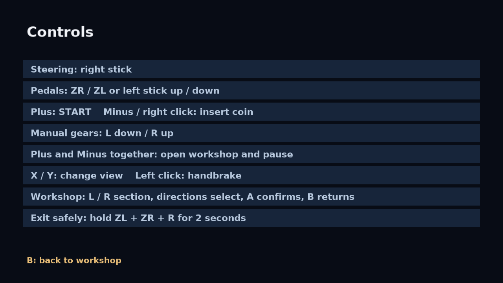

| Action | Button |
|---|---|
| Steer | Left stick (or the right stick: Workshop > Driving > Steering stick) |
| Gas / brake | ZR / ZL, or the other stick up / down (analog) |
| Gears (manual cars) | L down, R up |
| Start | + |
| Insert a coin | − (or click the right stick) |
| Change view | X / Y |
| Handbrake | Click the left stick |
| **Workshop, and pause** | **+ and − together** |
| In the Workshop | L / R section, up / down select, A change, B back to the race |
| Quit cleanly | Hold ZL + ZR + R for 2 seconds |

The Controls page in the Workshop (Driving > Controls) always shows the buttons for your current stick choice.

<a id="the-workshop"></a>

## The Workshop (+ and − together)

The game pauses, the Workshop opens. Seven sections, L / R to move between them. **Active mods** (top right) tells how
many mods are on.

### Driving

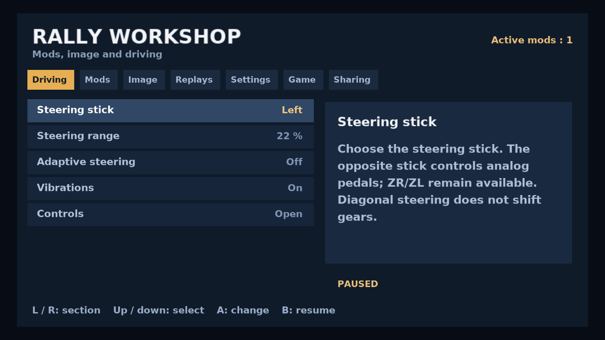

- **Steering stick**: left or right. The other stick then works the pedals (analog gas and brake); ZR / ZL still work.
- **Steering range**: 22 % is the reference; 50 % reaches both ends of the arcade wheel.
- **Adaptive steering**: a gentler wheel at high speed. The range you chose stays the limit.
- **Vibrations**: rumble on shocks, jumps, gear changes, and a constant hum. Joy-Con and compatible controllers.
- **Controls**: the controls page above.

### Mods

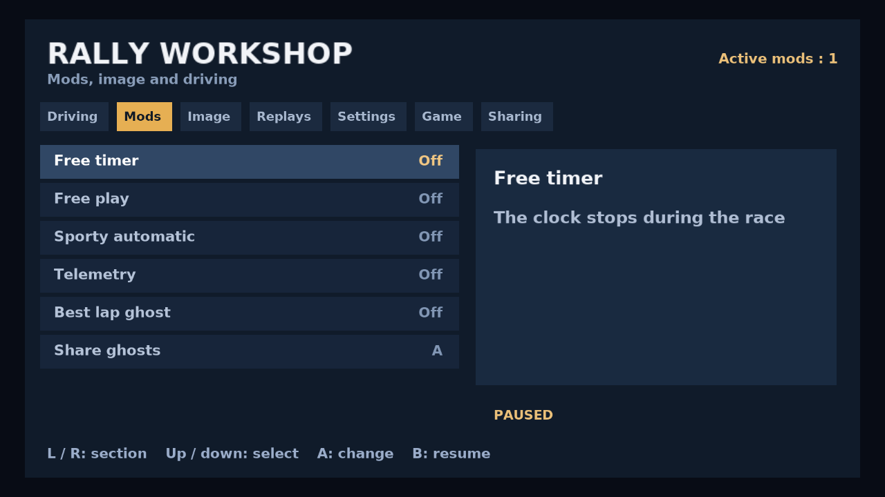

- **Free timer**: the clock stops during the race.
- **Free play**: Start gives the credits and starts the game, no coin needed.
- **Sporty automatic**: for a manual car, the gears change by themselves with the speed; L and R keep priority.
- **Telemetry**: speed, position, lap and pedals during the race, read from the game itself (no invented engine values).
- **Best lap ghost**: race against your best lap. **Share ghosts** exports them.

### Image

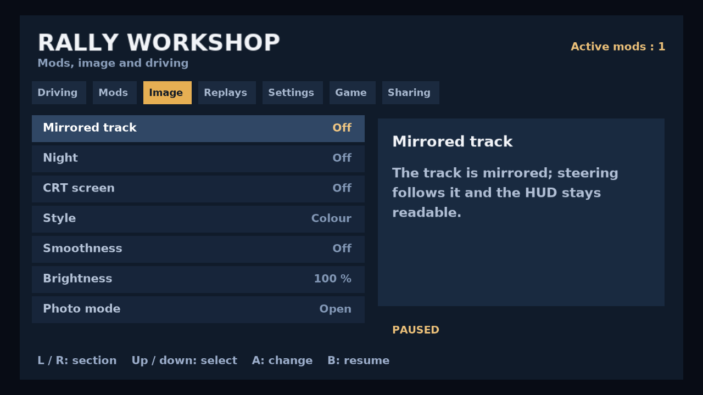

- **Mirrored track**: the whole track mirrored; the steering follows and the HUD stays readable.
- **Night**, **CRT screen**, **Style** (colour, comic book, black and white).
- **Smoothness**: optional picture smoothing (softer text, costs a little fluidity). Off by default.
- **Brightness**, and **Photo mode**: freeze, frame, save a PNG on the SD card.

### Replays

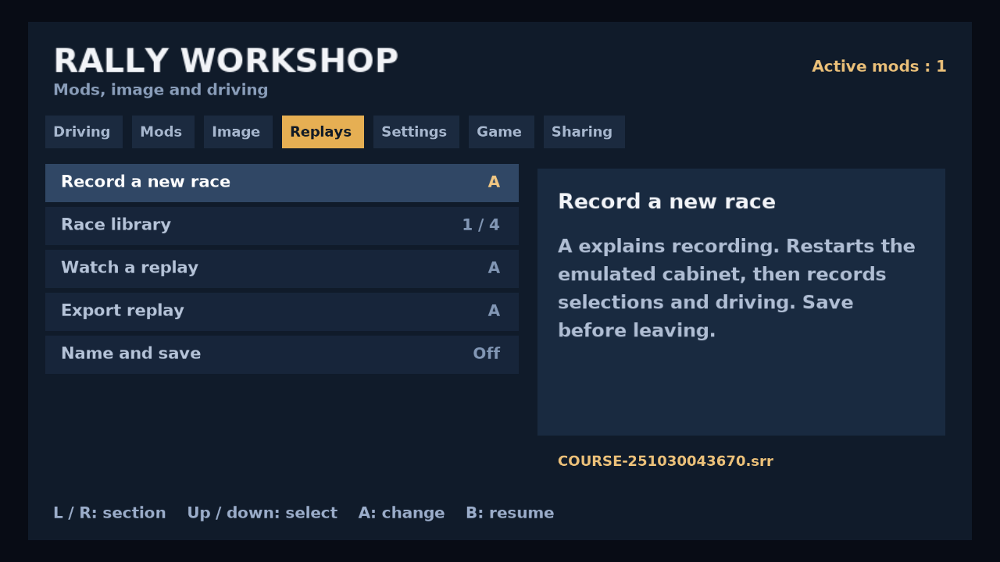

See [Replays](#replays).

### Settings

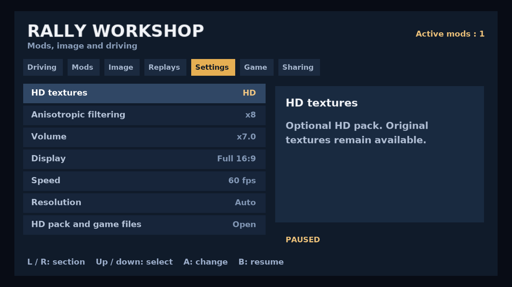

- **HD textures**: on or off (when the pack is installed). **Anisotropic filtering** for the HD textures (x8 is the tested default).
- **Volume**, **Display** (Full 16:9 extends the world and keeps its full height; Full 4:3 is the original framing),
  **Speed** (60 fps, or the arcade's original speed),
  **Resolution** (automatic or fixed).
- **HD pack and game files**: where the game looks, and what it found.

### Game

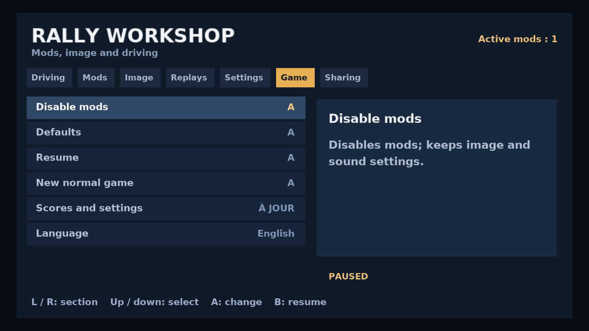

- **Disable mods** (keeps image and sound settings), **Defaults** (HD if installed, x8, volume x7, steering 22 %, full
  16:9, mods off), **Resume**, **New normal game**.
- **Scores and settings**: saves now; wait for the "up to date" mark.
- **Language**: ten languages.

### Sharing

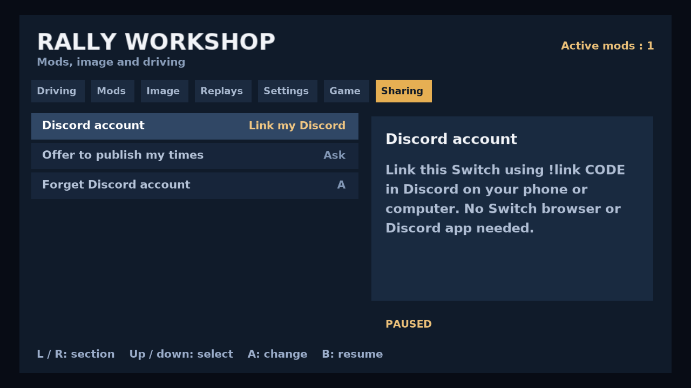

The Discord leaderboard: see [below](#the-leaderboard-on-discord).

## Replays

1. Workshop > **Replays** > **Record a new race** > A, then confirm. The emulated cabinet restarts on its start screen
   (shaders and textures stay loaded). Choose your mode and car, and drive: everything is recorded.
2. Workshop > Replays > **Name and save**. The keyboard proposes a name: L deletes, the directions pick a letter, A adds
   it, R adds a space, − clears, + saves, B cancels. 40 characters max. Saving does not stop the race.
3. **Race library** / **Watch a replay**: up / down choose, A plays. The car is driven by the recorded inputs; your
   records are not touched.
4. **Export replay** copies it to `/switch/segarally/gpt61sol/replays/exports/`. To watch someone's replay, copy their
   `.srr` into `/switch/segarally/gpt61sol/replays/`.

A replay is saved inputs, not a video: it needs the same version of the game and the same game files. To turn one into
a video, record the Switch's HDMI output (dock) with a capture card while it plays.

## HD textures

Jean-seb's community pack, optional. Extract it to:

```
/switch/segarally/gpt61sol/texpack/srallyc/
```

`srallyc.pat` and the images must be **directly** in that folder, with no extra sub-folder. A pack zip dropped in
`/Download/` is found and extracted there automatically. At launch, without a pack, **B** plays with the original
textures and **Y** stops asking. An installed pack is never replaced automatically. The first launch with HD builds a
cache: keep it when you update.

## The leaderboard on Discord

1. Workshop > **Sharing** > **Discord account** shows a code.
2. On your phone or computer, send `!link CODE` in any channel of the [Port0r Discord](https://discord.gg/XMk7GgapuN)
   or in a private message to the bot. Nothing to install on the Switch.
3. After a real race, the game asks before publishing your time (**Offer to publish my times**: Ask or Never). Replays
   and free-timer times are never published. Your times land in #leaderboard.
4. **Forget Discord account** removes the link from this Switch.

The Switch needs an internet connection for this. It is the first public version of the Switch link: if anything goes
wrong, tell us in #bugs.

## Saves, settings and updates

- Scores and arcade settings are saved automatically during play; Workshop > Game > Scores and settings saves now.
- **Updating**: replace `/switch/segarally/gpt61sol/segarally.nro` with the new one. Settings, records, replays, ghosts
  and the HD cache stay. The HOME tile needs nothing.
- To go back to an older version, put its `.nro` back; your data stays.
- New replays use the replay format 7; replays of older versions still play. An older version cannot read new replays.

## Troubleshooting

| What you see | What to do |
| --- | --- |
| The start screen lists missing files | Put `srallyc.zip` and `segabill.zip`, not unzipped, in `/switch/segarally/gpt61sol/roms/`, then press A. The files must be made for MAME 0.289. |
| It says a file is wrong | Drop the right zip in `/Download/` (up to three sub-folders deep): a different size or a newer date replaces the old copy at the next launch. |
| It closes or freezes at launch | Open it in application mode: hold R while opening a game, then the Homebrew Menu. Not from the Album. |
| No HD textures | `srallyc.pat` must be directly in `/switch/segarally/gpt61sol/texpack/srallyc/`, not in a sub-folder. Then Workshop > Settings > HD textures. |
| The HOME tile opens nothing | Check the two files in `/atmosphere/contents/0100534552000000/romfs/`. |
| A replay will not play | Same game version and same game files needed. |
| The Discord code is refused | Send exactly `!link CODE`, within a few minutes; the Switch must be online. Tell us in #bugs. |
| Stuck anywhere | Ask on the [Discord](https://discord.gg/XMk7GgapuN): #install-help, or the bot in #ask-port0r. |

## Known limits

- 60 images a second is the target and holds on the stages we measured, docked, without capture; it is not promised on
  every part of every track.
- A few Switch-only texts still show in English whatever the language.
- The Discord link is new on the Switch (tested on a local server, not yet by players): please report problems.

## Help, bugs, support

- **Discord**: https://discord.gg/XMk7GgapuN (#install-help, #bugs, #wishes, #leaderboard, and #sega-rally-switch)
- **Bugs**: #bugs, or a [GitHub issue](https://github.com/jacquesdupontd/port0r/issues) with your firmware version and
  what you see.
- **Support the project**: [Ko-fi](https://ko-fi.com/port0r), or just share it, it helps a lot.

## Credits and legal

- HD textures: Jean-seb.
- Built on MAME (GPL). Port0r: a free fan project, by the same people as
  [Port0r on Meta Quest](README.md) (arcade games in true 3D VR).

Sega Rally Championship is a trademark of SEGA. Port0r is not affiliated with SEGA or Nintendo. No game files are
included, ever.
